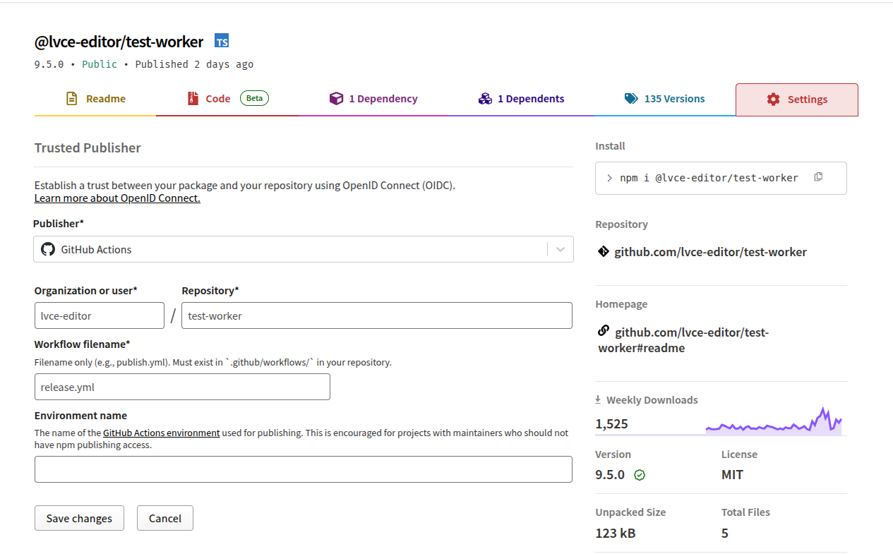

# 4 ways to solve npm publishing errors when using openid connect

Here are 4 common errors that can occur when using npm openid connect publishing and how to solve them.

## 1. Missing permissions in release.yml

Make sure to have the right permissions configured in your `release.yml` file:

```yml
permissions:
  id-token: write # Required for OIDC
  contents: write
```

## 2. Wrong repository url configured on the npm website

While in most cases, the repository url will match the package name, in some cases
they can be different, for example when using multiple packages in a monorepo.

Ensure to enter the correct url of the github repository on the npm settings page.



## 3. Missing repository url in package json

Ensure the git repository url in package json is configured, for example

```json
{
  "name": "@lvce-editor/test-worker",
  "description": "Test Worker",
  "repository": {
    "type": "git",
    "url": "git+https://github.com/lvce-editor/test-worker.git"
  }
}
```

## 4. Not using Node 24 or later

When everything is configured correctly, but the project is using an older node version, npm will show a 404 error for some reason, for example:

```sh
npm notice Publishing to https://registry.npmjs.org/ with tag latest and public access
npm error code E404
npm error 404 Not Found - PUT https://registry.npmjs.org/@lvce-editor%2ftest-worker - Not found
npm error 404
npm error 404  '@lvce-editor/test-worker@9.1.0' is not in this registry.
npm error 404
npm error 404 Note that you can also install from a
npm error 404 tarball, folder, http url, or git url.
npm error A complete log of this run can be found in: /home/runner/.npm/_logs/2025-10-27T10_10_00_305Z-debug-0.log
```

Ensure using node version 24 or later.
